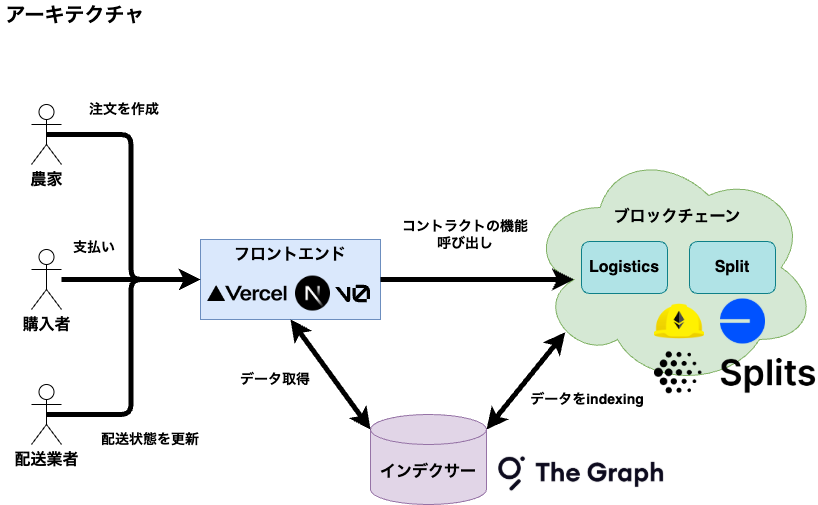

# manaphy

## 概要

## アーキテクチャ図



## Live Demo

[https://manaphy-nine.vercel.app/](https://manaphy-nine.vercel.app/)

## Product Page - Akindo

[農家・物流・購入者をつなぐ次世代流通基盤](https://app.akindo.io/communities/kzKmM4XWVIVM6rmV/products/xKzBdzXWMhNljEmk)

## How to work

- **セットアップ**

  `pkgs/contract/.env` に 以下の環境変数を設定する。

  ```txt
  PRIVATE_KEY=""
  BASESCAN_API_KEY=""
  ALCHEMY_API_KEY=""
  GAS_REPORT=true
  COINMARKETCAP_API_KEY=""
  SPLITS_API_KEY=
  ```

- **インストール**

  ```bash
  yarn
  ```

- **スマートコントラクトのテスト**

  ```bash
  yarn contract test
  ```

- **SplitsWarehouseコントラクトのデプロイ**

  ```bash
  yarn contract deploy:Split --network baseSepolia
  ```

- **PullSplitFactoryとPushSplitFactoryコントラクトのデプロイ**

  ```bash
  yarn contract deploy:SplitFactories --network baseSepolia
  ```

- **Logistics コントラクトをデプロイ**

  ```bash
  yarn contract deploy:Logistics --network baseSepolia
  ```

- **Splitコントラクトの作成**

  ```bash
  yarn contract createSplit --network baseSepolia
  ```

- **Splitコントラクトのトークンの残高確認**

  ```bash
  yarn contract getSplitBalance --network baseSepolia
  ```

- **Splitコントラクトを使ってトークンを分配する**

  ```bash
  yarn contract distribute --network baseSepolia
  ```

- **オーダーを作成する**

  ```bash
  yarn contract createOrder --network baseSepolia
  ``` 

- **オーダーと紐づいたSplitコントラクトに入金する**

  ```bash
  yarn contract deposit --id 0 --amount 0.1 --network baseSepolia
  ```

- **注文IDを指定して作成済みのオーダーを全て取得する**

  ```bash
  yarn contract getOrder --id 0 --network baseSepolia
  ```

- **作成済みのオーダーを全て取得する**

  ```bash
  yarn contract getAllOrders --network baseSepolia
  ```

- **オーダーの状態を配達済みにして支払いを実行する**

  ```bash
  yarn contract updateOrderStatus --id 0 --network baseSepolia
  ```

- **支払いされたお金を受け取る**

  ```bash
  yarn contract withdraw --token 0xEeeeeEeeeEeEeeEeEeEeeEEEeeeeEeeeeeeeEEeE --network baseSepolia
  ```

- **フロントエンドのビルド**

  ```bash
  yarn frontend build
  ```

- **フロントエンドの起動**

  ```bash
  yarn frontend dev
  ```

- **subgraphのCodeGen & CodeBuild**

  ```bash
  yarn subgraph codegen
  ```

  ```bash
  yarn subgraph build 
  ```

## デプロイしたサブグラフ

[https://api.studio.thegraph.com/query/44992/subgraph/"v0.0.1"](https://api.studio.thegraph.com/query/44992/subgraph/"v0.0.1")

- 全ての注文情報を取得するクエリ

  ```gql
  query GetAllOrders {
    orderCreateds(orderBy: orderId, orderDirection: desc) {
      orderId
      price
      productName
      productStatus
      quantity
      recipients
      shippingFee
      splitContract
      status
      tokenAddress
      totalAllocation
      transactionHash
    }
  }
  ```

- 注文IDを指定して注文情報を取得するクエリ

  ```gql
  query MyQuery {
    orderCreateds(
      orderBy: orderId, 
      orderDirection: desc, 
      where: {orderId: "0"}
    ) {
      orderId
      price
      productName
      productStatus
      quantity
      recipients
      shippingFee
      splitContract
      tokenAddress
      totalAllocation
      transactionHash
      status
    }
    orderStatusChangeds(
      orderBy: blockTimestamp
      orderDirection: desc
      first: 1
      where: {orderId: "0"}
    ) {
      orderId
      status
    }
  }
  ```