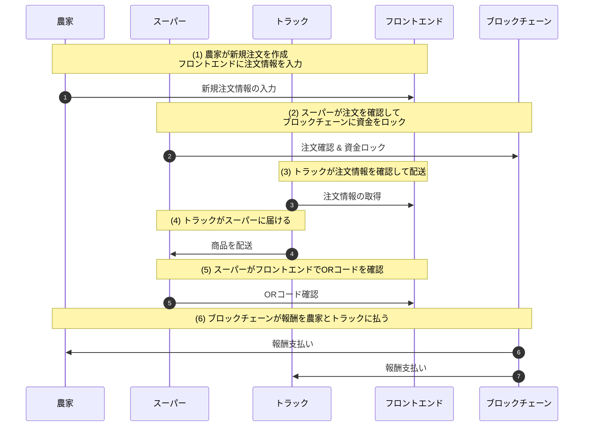

```mermaid
sequenceDiagram
    autonumber
    participant 農家
    participant スーパー
    participant トラック
    participant フロントエンド
    participant ブロックチェーン

    Note over 農家,フロントエンド: (1) 農家が新規注文を作成<br>フロントエンドに注文情報を入力
    農家->>フロントエンド: 新規注文情報の入力

    Note over スーパー,ブロックチェーン: (2) スーパーが注文を確認して<br>ブロックチェーンに資金をロック
    スーパー->>ブロックチェーン: 注文確認 & 資金ロック

    Note over トラック,フロントエンド: (3) トラックが注文情報を確認して配送
    トラック->>フロントエンド: 注文情報の取得
    
    Note over トラック,スーパー: (4) トラックがスーパーに届ける
    トラック->>スーパー: 商品を配送

    Note over スーパー,フロントエンド: (5) スーパーがフロントエンドでORコードを確認
    スーパー->>フロントエンド: ORコード確認

    Note over ブロックチェーン,農家: (6) ブロックチェーンが報酬を農家とトラックに払う
    ブロックチェーン->>農家: 報酬支払い
    ブロックチェーン->>トラック: 報酬支払い
```
